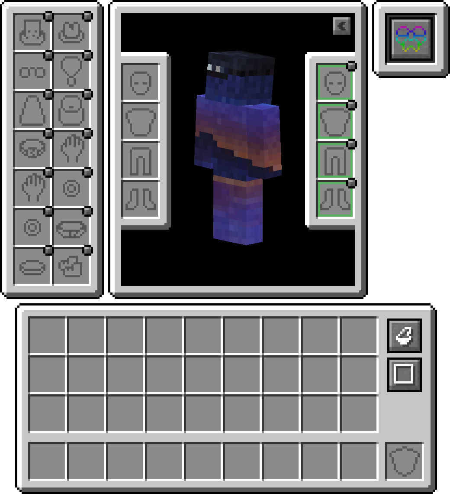

<link rel="stylesheet" href="../Styles/Stylesheet.css">

<a href="../README.md" class="nav-back">← Back to Wiki Home</a>

# Accessories / Curios

Accessories and Curios are two mod systems that create additional equipment slots on your character, allowing you to equip items beyond the standard armor slots. These systems are essential for equipping items like elytra, backtanks, backpacks, necklaces, and various other accessories without sacrificing your armor or inventory space.

## About

The accessory system in SimplyFellas is built on two complementary mods: **Accessories** and **Curios API**. Together, they provide a flexible framework for additional equipment slots that mods can use to add wearable items. This system allows you to:

- Equip your elytra without removing your chestplate
- Wear backtanks and jetpacks from Create mods
- Use backpacks as wearable items
- Equip cosmetic armor pieces
- Wear necklaces, rings, and other accessories
- Use various utility items that benefit from being equipped rather than held

This system greatly enhances gameplay by allowing you to combine multiple utility and cosmetic items simultaneously, making character customization and optimization much more flexible.

## How It Works

### Accessories Mod

The Accessories mod provides a simple, lightweight accessory slot system. It's designed to be compatible with various mods and allows for easy addition of accessory slots.

### Curios API

Curios API is the more comprehensive system, providing a framework that other mods can use to add their own accessory slots. It supports multiple slot types and allows mods to define which items can go in which slots.

### Elytra Slot

The Elytra Slot mod adds a dedicated back slot specifically for elytra. This allows you to equip your elytra without using your chestplate slot, so you can fly while still wearing full armor!

### Create Integration

Create mods integrate with the accessory system to allow you to equip Create-specific items like backtanks and jetpacks from Create: Stuff & Additions in accessory slots, making them more convenient to use.

---

## Key Features

- **Multiple Equipment Slots**: Access multiple equipment slots beyond the standard armor slots
- **Elytra Support**: Equip elytra without sacrificing your chestplate slot
- **Backtank Integration**: Wear Create backtanks as accessories
- **Jetpack Support**: Equip jetpacks from Create mods in accessory slots
- **Backpack Compatibility**: Wear backpacks as equipped items
- **Cosmetic Armor**: Equip cosmetic armor pieces for visual customization
- **Mod Compatibility**: Works seamlessly with many mods that add wearable items

---

## Usage Tips

- **Elytra**: Press the inventory key and look for the back/elytra slot to equip your elytra
- **Backtanks**: Create backtanks can be equipped in accessory slots for easy access to compressed air
- **Jetpacks**: Jetpacks from Create: Stuff & Additions can be worn as accessories
- **Multiple Items**: You can typically equip multiple different accessories simultaneously
- **Cosmetic Armor**: Some mods allow you to show cosmetic armor while wearing functional armor underneath

---

## Credits & Attributions

### Authors

* **Accessories & Accessories Compat Layer**: [Blodgharm](https://curseforge.com/members/blodhgarm)
* **Curios API & Elytra Slot**: [TheIllusiveC4](https://curseforge.com/members/theillusivec4)
* **Create: Curios Jetpack & Backtank**: [robinfrt](https://curseforge.com/members/robinfrt)

### Mods

* [Accessories](https://curseforge.com/minecraft/mc-mods/accessories) - Provides a simple accessory slot system for equipping additional items
* [Accessories Compat Layer](https://curseforge.com/minecraft/mc-mods/accessories-compat-layer) - Compatibility layer for Accessories mod
* [Curios API](https://curseforge.com/minecraft/mc-mods/curios) - Comprehensive framework for accessory slots that other mods can use
* [Elytra Slot](https://curseforge.com/minecraft/mc-mods/elytra-slot) - Adds a dedicated back slot specifically for elytra, allowing you to wear elytra and chestplate simultaneously
* [Create: Curios Jetpack & Backtank](https://www.curseforge.com/minecraft/mc-mods/create-curios-jetpack) - Allows Create backtanks and jetpacks to be equipped in Curios accessory slots

