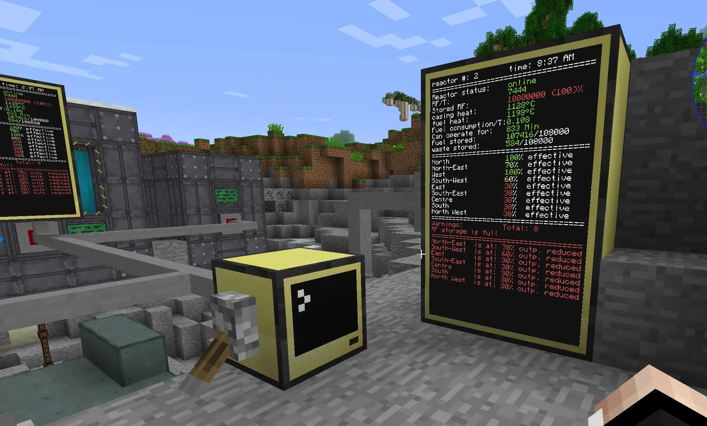
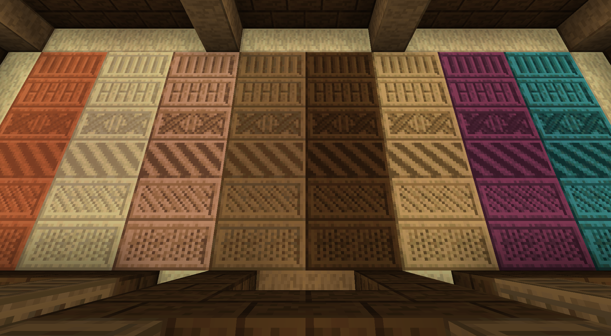
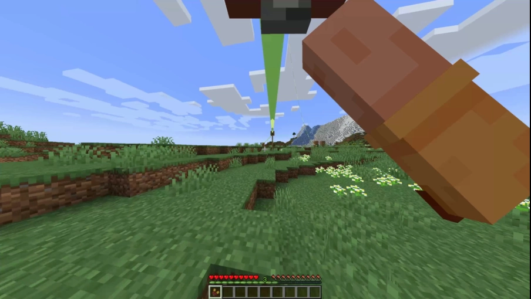

<link rel="stylesheet" href="../../Styles/Stylesheet.css">

<a href="../../WikiHomepage.md" class="nav-back">← Back to Wiki Home</a>

# Factory Additions

There are several factory additions to SimplyFellas that are designed to help bring more content and quality of life to the pack. These mods enhance automation, building, decoration, and provide useful tools for factory construction and management.

## About

The following mods further enhance the modpack by adding alloy forging, computers, spawner management, more blocks, construction tools, management wands, and fun tools. These additions complement the Create ecosystem and provide additional automation and building capabilities beyond what Create offers alone.

---

## Automation & Processing

### Alloy Forgery

Adds different variations of alloy forges that allow you to achieve basic ore duplication. This provides an early-game method for increasing your ore yields through alloy smelting.

### Modular Routers

Adds item routers which can pull, send, place, break, drop, absorb, fling, sort, void, interact, and more with any item. These powerful automation blocks can perform complex item routing and manipulation tasks, making them essential for advanced factory setups.

### Apothic Spawners

Allows you to pick up spawners with silk touch, adds a new enchantment to drop mob eggs, and allows changing spawner types with mob eggs as well as enhancing spawners with other items. Perfect for creating custom mob farms!

---

## Computing & Logic

### CC: Tweaked (ComputerCraft)

ComputerCraft is a mod that adds various computers and blocks such as turtles that can be programmed in Lua. Build automated systems using code, create programmable robots, and automate complex tasks through programming.

---

## Decoration & Building

### Rechiseled & Rechiseled: Create

Adds chisels that you can use to chisel a variety of blocks into many different decorative options. Rechiseled: Create integrates the rechiseled mod into the Create blocks for even more decorative options. Perfect for adding detail and variety to your builds!

### Construction Wands: Revived

Adds construction wands you can use to place walls of blocks easily. Great for quickly building structures and large walls without placing blocks one by one.

---

## Utility Tools

### Pipe Connector

A craftable utility tool that places pipes from any mod given a starting and ending point. Automatically connects pipes between two points, making pipe installation much easier!

### Villagers' Wand

A utility wand that you can use to manage villagers such as resetting their profession, having them follow you, or freezing them in place. Essential for villager trading setups!

### Zipline

A tool like the Satisfactory zipline that allows you to zip around on your electricity wires. Provides fast transportation across your factory!

---

## Image Gallery

    

        
    

    

        
    

    

        
    

    

        
    

    

        
    

---

## Credits & Attributions

### Authors

* **Alloy Forgery**: [gliscowo](https://curseforge.com/members/gliscowo)
* **CC: Tweaked**: [squiddev](https://modrinth.com/user/squiddev)
* **Modular Routers**: [desht_08](https://curseforge.com/members/desht_08)
* **Apothic Spawners**: [Shadows_of_Fire](https://curseforge.com/members/shadows_of_fire)
* **Rechiseled & Rechiseled: Create**: [Supermartijn642](https://curseforge.com/members/supermartijn642)
* **Construction Wands: Revived**: [NadienDev](https://curseforge.com/members/nadiendev)
* **Pipe Connector**: [Heaser](https://curseforge.com/members/heaser)
* **Villagers' Wand**: [EightySeven](https://curseforge.com/members/eightyseven)
* **Zipline**: [Tomate0613](https://curseforge.com/members/tomate0613)

### Mods

* [Alloy Forgery](https://curseforge.com/minecraft/mc-mods/alloy-forgery) - Adds different variations of alloy forges that allow you to achieve basic ore duplication
* [CC: Tweaked](https://modrinth.com/mod/cc-tweaked) - ComputerCraft mod that adds various computers and blocks such as turtles that can be programmed in Lua
* [Modular Routers](https://curseforge.com/minecraft/mc-mods/modular-routers) - Adds item routers which can pull, send, place, break, drop, absorb, fling, sort, void, interact, and more with any item
* [Apothic Spawners](https://curseforge.com/minecraft/mc-mods/apothic-spawners) - Allows you to pick up spawners with silk touch, adds a new enchantment to drop mob eggs, and allows changing spawner types with mob eggs as well as enhancing spawners with other items
* [Rechiseled](https://curseforge.com/minecraft/mc-mods/rechiseled) - Adds chisels that you can use to chisel a variety of blocks into many different decorative options
* [Rechiseled: Create](https://curseforge.com/minecraft/mc-mods/rechiseled-create) - Integrates the rechiseled mod into the Create blocks for even more decorative options
* [Construction Wands: Revived](https://curseforge.com/minecraft/mc-mods/construction-wands-revived) - Adds construction wands you can use to place walls of blocks easily
* [Pipe Connector](https://curseforge.com/minecraft/mc-mods/pipe-connector) - A craftable utility tool that places pipes from any mod given a starting and ending point
* [Villagers' Wand](https://curseforge.com/minecraft/mc-mods/villagers-wand) - A utility wand that you can use to manage villagers such as resetting their profession, having them follow you, or freezing them in place
* [Zipline](https://www.curseforge.com/minecraft/mc-mods/zipline) - A tool like the Satisfactory zipline that allows you to zip around on your electricity wires

