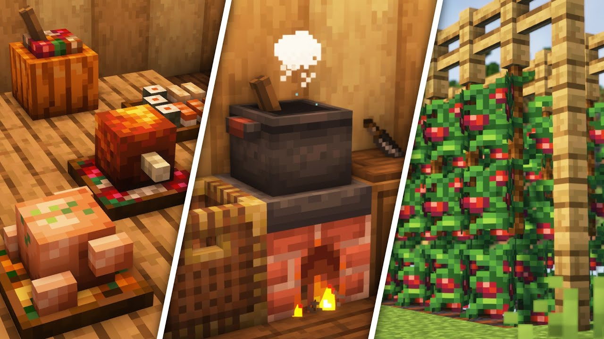
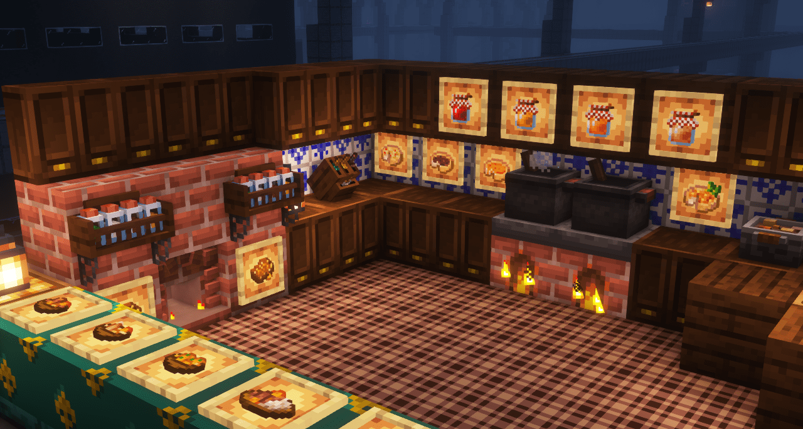
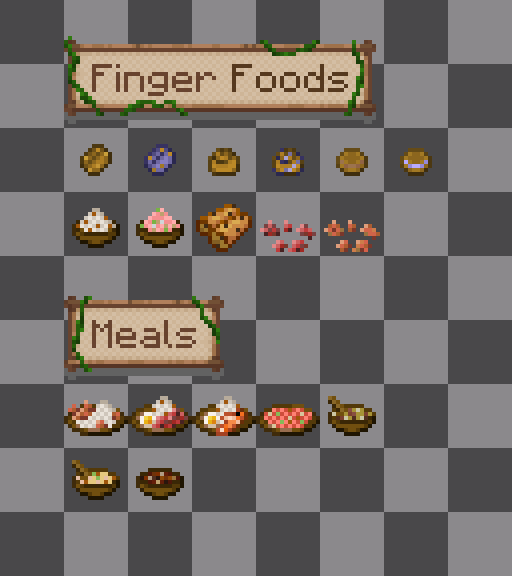
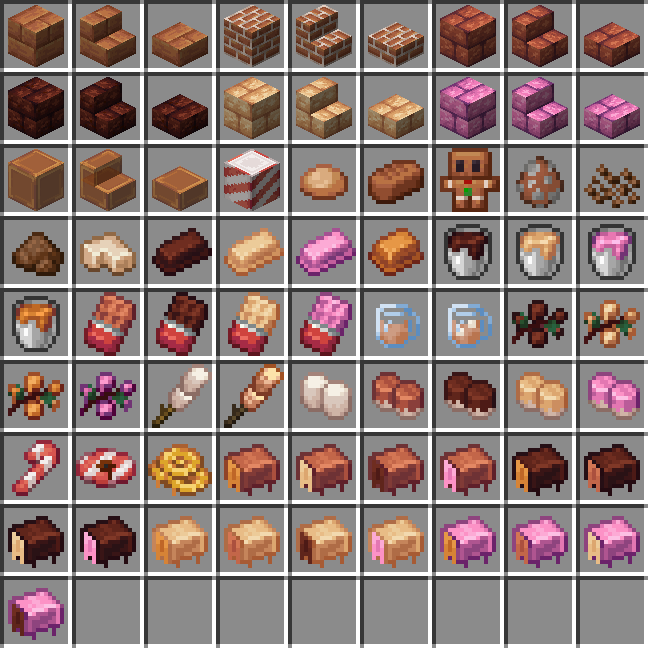

<link rel="stylesheet" href="../Styles/Stylesheet.css">

<a href="../README.md" class="nav-back">← Back to Wiki Home</a>

# Food

SimplyFellas integrates a wide variety of food mods that dramatically expand cooking, farming, and culinary options. If you can think of a food, then it's likely you'll be able to craft it in this pack!

## About

There are tons of mods that add different foods like Farmer's Delight, Extra Delight, Butchercraft that add tons of meats, mods like Create: Confectionary that adds tons of chocolate, and way more. The food system in SimplyFellas is comprehensive, offering hundreds of new food items, ingredients, recipes, and cooking methods. Many of these foods can be fully automated with Create mods, making food production a fully integrated part of your factory!

---

## Core Food Mods

### Farmer's Delight

The original Minecraft food mod, adds tons of farmable foods and ingredients to use! Farmer's Delight provides a comprehensive cooking system with new crops, cooking tools, and delicious meals. Build kitchens and create gourmet meals!

### Extra Delight

This mod expands upon Farmer's Delight and expands upon cooking. Adds even more recipes, ingredients, and cooking methods to create an even more diverse culinary experience!

### Butchercraft

This mod adds butchering to Minecraft. There are meat hooks, cleavers, and ways to turn mobs into various different foods. Butchercraft adds depth to meat preparation and provides new ways to process animal products into delicious meals!

### Tide

This mod heavily expands upon fishing, offering 60+ new types of fish as well as bait and bobbers. Fishing becomes a major source of food variety, with dozens of new fish types to catch and cook!

---

## Create Food Integration

### Create: Food

Adds tons of different types of foods and fluids, all automatable with Create! Build automated food production lines using Create contraptions to process ingredients and create meals automatically.

### Create: Confectionary

This mod allows you to create your own chocolate factory! Adds cocoa, butter, cocoa powder, chocolate, marshmallow, and more. Perfect for building automated confectionary production systems with Create!

### Create: Slice & Dice

This mod integrates Farmer's Delight and Create with all new Create recipes. Automate food processing from Farmer's Delight using Create machinery!

### Create: Central Kitchen

This mod adds all new recipes for both Farmer's Delight and Extra Delight with the Create mod. Further expands food automation possibilities, allowing you to automate complex cooking processes!

---

## Food Production & Automation

With the combination of Farmer's Delight, Extra Delight, Create: Food, Create: Confectionary, Create: Slice & Dice, and Create: Central Kitchen, you can build fully automated food production systems. From growing crops to processing ingredients to cooking meals, every step can be automated using Create contraptions!

---

## Image Gallery

    

        
    

    

        
    

    

        
    

    

        
    

    

        
    

    

        
    

    

        
    

    

        
    

---

## Credits & Attributions

### Authors

* **Farmer's Delight**: [vectorwing](https://curseforge.com/members/vectorwing)
* **Extra Delight / Butchercraft**: [Lance5057](https://curseforge.com/members/lance5057)
* **Tide**: [Lightning64](https://curseforge.com/members/lightning64)
* **Create: Food**: [average_anime](https://curseforge.com/members/average_anime)
* **Create: Confectionary**: [Furti_Two](https://curseforge.com/members/furti_two)
* **Create: Slice & Dice**: [possible_triangle](https://curseforge.com/members/possible_triangle)
* **Create: Central Kitchen**: [DragonsPlus](https://curseforge.com/members/dragonsplus)

### Mods

* [Farmer's Delight](https://curseforge.com/minecraft/mc-mods/farmers-delight) - The original Minecraft food mod, adds tons of farmable foods and ingredients to use!
* [Extra Delight](https://curseforge.com/minecraft/mc-mods/extradelight) - Expands upon Farmer's Delight and expands upon cooking
* [Butchercraft](https://curseforge.com/minecraft/mc-mods/butchercraft) - Adds butchering to Minecraft with meat hooks, cleavers, and ways to turn mobs into various different foods
* [Tide](https://curseforge.com/minecraft/mc-mods/tide) - Heavily expands upon fishing offering 60+ new types of fish as well as bait and bobbers
* [Create: Food](https://curseforge.com/minecraft/mc-mods/create-food) - Adds tons of different types of foods and fluids, all automatable with Create
* [Create: Confectionary](https://curseforge.com/minecraft/mc-mods/create-confectionery) - Allows you to create your own chocolate factory, adding cocoa, butter, cocoa powder, chocolate, marshmallow, and more
* [Create: Slice & Dice](https://curseforge.com/minecraft/mc-mods/slice-and-dice) - Integrates Farmer's Delight and Create with all new Create recipes
* [Create: Central Kitchen](https://curseforge.com/minecraft/mc-mods/create-central-kitchen) - Adds all new recipes for both Farmer's Delight and Extra Delight with the Create mod

