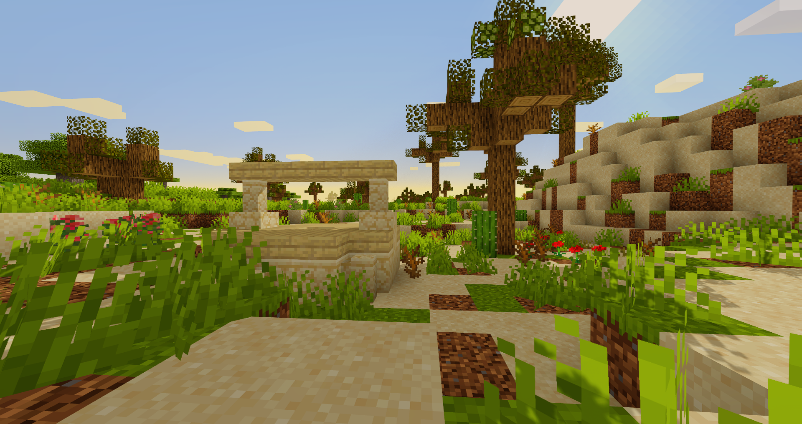

<link rel="stylesheet" href="Styles/Stylesheet.css">

<a href="Wiki Homepage" class="nav-back">← Back to Wiki Home</a>

# Structures

The SimplyFellas modpack features an extensive collection of structure mods that breathe new life into your Minecraft world! This section combines three major structure enhancement systems: **Moog's Structures**, which adds brand new vanilla-friendly structures across all dimensions; **YUNG's Better Structures**, which completely overhauls existing vanilla structures to be larger, more complex, and more rewarding; and **Explorify**, which adds explorable structures that encourage adventure and discovery.

## About

Structure generation in SimplyFellas is enhanced through a comprehensive collection of world generation mods. Together, these mods transform exploration from a simple task into an engaging adventure filled with diverse structures, hidden treasures, challenging encounters, and beautiful architecture. Whether you're seeking new structures to discover or enhanced versions of classic Minecraft structures, this modpack has you covered across all three dimensions.

---

## Getting Started with Structures

New to structure exploration? Check out these guides:

- **[Exploration & Structures Guide](Exploration-&-Structures)** - Complete guide to finding structures, exploration strategies, and loot priorities
- **[Getting Started Guide](Getting-Started)** - Learn the basics of SimplyFellas

For a complete overview of all guides, visit the [Guides Homepage](Guides-Homepage).

---

## Structure Location Guide

### Finding Structures

**Overworld Structures:**
- **Enhanced Vanilla Structures**: Use JourneyMap to locate enhanced dungeons, mineshafts, strongholds, and temples
- **Moog's Structures**: 130+ new structures scattered throughout the Overworld
- **Explorify Structures**: Additional explorable structures in various biomes
- **YUNG's Structures**: Enhanced versions of familiar structures

**Nether Structures:**
- **Enhanced Fortresses**: Larger, more complex Nether fortresses
- **Moog's Nether Structures**: New structures including graveyards, altars, and mansions
- Explore Nether biomes thoroughly to find new structures

**End Structures:**
- **Enhanced End Cities**: Improved End city generation
- **Moog's End Structures**: New End structures including pirate ships
- Explore outer End islands for new discoveries

### Exploration Tips

**Using JourneyMap:**
- Press `J` to open full map
- Look for structure markers on the map
- Set waypoints at discovered structures
- Use minimap for navigation while exploring

**Efficient Exploration:**
- Use elytra for fast travel between structures
- Bring adequate supplies (food, tools, weapons)
- Mark important structure locations
- Organize exploration routes

### Loot Priorities

**High-Value Loot:**
- Enchanted books from dungeons and temples
- Rare materials from structure chests
- Structure-specific unique items
- Valuable resources for progression

**Structure-Specific Rewards:**
- Each structure type has unique loot tables
- Enhanced structures often have better loot
- New structures may have exclusive items
- Check all chests thoroughly

---

## Moog's Structures

Moog's Structures is a bundle of structure-based world generation mods that adds various Minecraft-flavored structures to your world! These mods introduce entirely new structures that fit seamlessly into the vanilla aesthetic, providing fresh exploration opportunities and adventures.

### Moog's Voyager Structures

Moog's Voyager Structures adds over 130 vanilla-style structures to the Overworld, including dungeons, enemy encounters, and various buildings that enhance exploration and provide new challenges and loot opportunities.

### Moog's Soaring Structures

Adds floating islands with unique buildings scattered across the sky. These structures feature unique designs, valuable loot, and enemies that guard them. Perfect for players who enjoy vertical exploration and sky-based adventures.

### Moog's End Structures

Enhances the End dimension with new structures that add depth and variety to this otherworldly dimension. Discover new challenges, unique loot, and architectural wonders as you explore the End.

### Moog's Nether Structures

Introduces new structures in the Nether, including mansions, graveyards, altars, and more. Each structure comes with associated loot and mobs, making Nether exploration more diverse and rewarding.

---

## YUNG's Better Structures

YUNG's Better Structures is a massive pack of overhaul mods that enhance the vanilla Minecraft structures and world generation. Rather than adding completely new structures, these mods redesign and expand existing vanilla structures, making them larger, more complex, more interesting, and significantly more rewarding to explore.

### Overworld Structures

#### YUNG's Better Dungeons

Completely overhauls vanilla dungeons to be much more complex and engaging. These enhanced dungeons feature multiple rooms, varied layouts, better loot distribution, and more challenging encounters. Each dungeon is now a proper adventure worth exploring!

#### YUNG's Better Mineshafts

Improves mineshafts with new layouts, better tunnel systems, more variety in room types, and enhanced loot opportunities. Mining adventures become much more interesting with these overhauled mineshafts.

#### YUNG's Better Strongholds

Redesigns strongholds with over 15 new room types, improved tunnels, staircases, traps, and hidden areas. Strongholds are now sprawling underground complexes that provide much more content and exploration value. The enhanced layout makes finding the End Portal a more engaging experience.

#### YUNG's Better Desert Temples

Transforms desert temples into more elaborate structures with better puzzles, improved loot, and more interesting architecture. The enhanced temples provide a more satisfying adventure experience.

#### YUNG's Better Jungle Temples

Enhances jungle temples with better traps, improved layouts, more secrets, and better rewards. These temples now provide a more challenging and rewarding exploration experience.

#### YUNG's Better Ocean Monuments

Overhauls ocean monuments to be larger, more complex, and more interesting. The enhanced monuments feature better room layouts and improved exploration value.

#### YUNG's Bridges

Adds naturally generated bridges throughout the Overworld. These bridges connect different terrain features and add visual interest to the landscape while providing useful pathways for travel.

#### YUNG's Better Caves

Enhances cave generation with more interesting layouts, better connections, and improved exploration value. Caves become more varied and exciting to explore.

#### YUNG's Cave Biomes

Adds cave-specific biomes that make underground exploration more diverse and interesting. Each biome has unique characteristics and visual features.

#### YUNG's Extras

Adds various additional structure enhancements and improvements to complement the other YUNG's mods, including wells and other small structures.

### Nether Structures

#### YUNG's Better Nether Fortresses

Completely redesigns Nether fortresses to be larger, more complex, and more rewarding. The enhanced fortresses feature better room layouts, improved mob spawning, and better loot distribution.

### End Structures

#### YUNG's Better End Island

Enhances the main End island where you fight the Ender Dragon. The island features improved terrain generation and better integration with End structures.

---

## Explorify

Explorify adds various explorable structures to the world that encourage adventure and discovery. These structures are designed to be vanilla-friendly and provide new opportunities for exploration, treasure hunting, and adventure.

### Features

- **New Structures**: Adds a variety of new structures scattered throughout the world
- **Adventure Focus**: Structures are designed to encourage exploration and reward adventurous players
- **Vanilla Aesthetic**: All structures fit seamlessly into the vanilla Minecraft aesthetic
- **Diverse Locations**: Structures can be found in various biomes and locations

Explorify complements the other structure mods by adding even more variety and exploration opportunities to your world. Whether you're exploring new areas or revisiting familiar biomes, you're likely to encounter these new structures that add depth to your adventures.

---

## Structure Mod Integration

These three structure mod systems work together seamlessly to create a rich, diverse world filled with exploration opportunities:

- **Moog's Structures** provides brand new structures to discover
- **YUNG's Better Structures** enhances familiar structures to be more engaging
- **Explorify** adds additional explorable structures for more variety

Together, they ensure that exploration remains exciting and rewarding throughout your entire Minecraft journey, from early game to late game, across all three dimensions.

---

### Structure Gallery

    

        
    

    

        
    

    

        
    

    

        
    

    

        
    

    

        
    

    

        
    

    

        
    

    

        
    

    

        
    

    

        
    

    

        
    

    

        
    

    

        
    

    

        
    

    

        
    

    

        
    

    

        
    

    

        
    

    

        
    

    

        
    

---

## Credits & Attributions

### Authors

* **Moog's Structures**:
  * [finndog_123](https://curseforge.com/members/finndog_123)
  * [joshieman](https://curseforge.com/members/joshieman)

* **YUNG's Better Structures**:
  * [yungnickyoung](https://curseforge.com/members/yungnickyoung)

* **Explorify**:
  * [bebebea_loste](https://curseforge.com/members/bebebea_loste)

### Mods

#### Moog's Structures Mods

* [Moog's Voyager Structures](https://curseforge.com/minecraft/mc-mods/moogs-voyager-structures) - Adds over 130 vanilla-style structures to the Overworld
* [Moog's Soaring Structures](https://curseforge.com/minecraft/mc-mods/mss-moogs-soaring-structures) - Adds floating islands with unique buildings and loot
* [Moog's End Structures](https://curseforge.com/minecraft/mc-mods/moogs-end-structures) - Enhances the End dimension with new structures
* [Moog's Nether Structures](https://curseforge.com/minecraft/mc-mods/mns-moogs-nether-structures) - Adds new structures to the Nether including mansions, graveyards, and altars

#### YUNG's Better Structures Mods

* [YUNG's Better Dungeons](https://curseforge.com/minecraft/mc-mods/yungs-better-dungeons) - Completely overhauls vanilla dungeons to be more complex and engaging
* [YUNG's Better Mineshafts](https://curseforge.com/minecraft/mc-mods/yungs-better-mineshafts-forge) - Improves mineshafts with new layouts and better tunnel systems
* [YUNG's Better Strongholds](https://curseforge.com/minecraft/mc-mods/yungs-better-strongholds) - Redesigns strongholds with over 15 new room types, improved tunnels, and hidden areas
* [YUNG's Better End Island](https://curseforge.com/minecraft/mc-mods/yungs-better-end-island) - Enhances the main End island with improved terrain generation
* [YUNG's Better Nether Fortresses](https://curseforge.com/minecraft/mc-mods/yungs-better-nether-fortresses) - Completely redesigns Nether fortresses to be larger and more complex
* [YUNG's Better Ocean Monuments](https://curseforge.com/minecraft/mc-mods/yungs-better-ocean-monuments) - Overhauls ocean monuments to be larger and more interesting
* [YUNG's Better Desert Temples](https://curseforge.com/minecraft/mc-mods/yungs-better-desert-temples) - Transforms desert temples into more elaborate structures
* [YUNG's Better Jungle Temples](https://curseforge.com/minecraft/mc-mods/yungs-better-jungle-temples) - Enhances jungle temples with better traps and improved layouts
* [YUNG's Bridges](https://curseforge.com/minecraft/mc-mods/yungs-bridges) - Adds naturally generated bridges throughout the Overworld
* [YUNG's Better Caves](https://curseforge.com/minecraft/mc-mods/yungs-better-caves) - Enhances cave generation with more interesting layouts
* [YUNG's Cave Biomes](https://curseforge.com/minecraft/mc-mods/yungs-cave-biomes) - Adds cave-specific biomes for more diverse underground exploration
* [YUNG's Extras](https://curseforge.com/minecraft/mc-mods/yungs-extras) - Adds various additional structure enhancements including wells

#### Explorify

* [Explorify](https://curseforge.com/minecraft/mc-mods/explorify) - Adds various explorable structures to the world that encourage adventure and discovery

