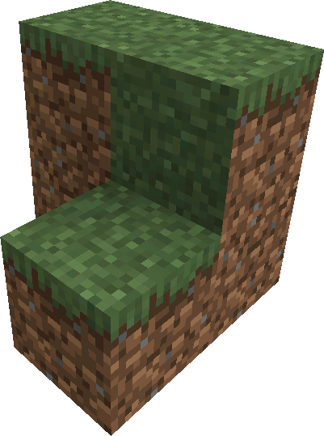
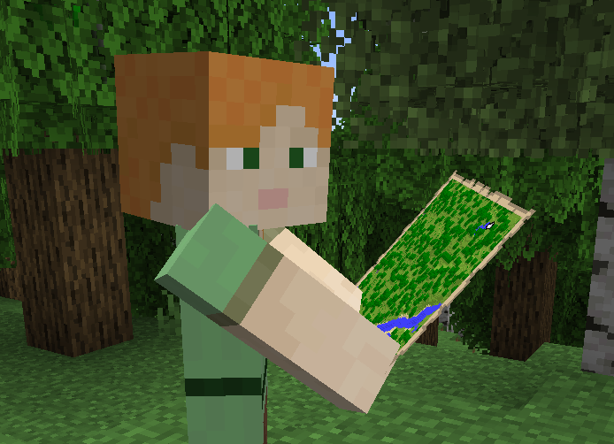

<link rel="stylesheet" href="../../Styles/Stylesheet.css">

<a href="../../WikiHomepage.md" class="nav-back">← Back to Wiki Home</a>

# Visuals

SimplyFellas includes various mods that enhance your visual experience. From Iris Shaders to falling leaves from trees, there's everything to make your experience beautiful and immersive.

## About

While this pack maintains the same vanilla world generation, we have worked hard to make your experience look no less than outstanding. We include everything from furniture to dynamic lighting, better grass, better UI elements, more effects, and so much more. The visual enhancements in SimplyFellas transform the game's appearance while maintaining the vanilla aesthetic.

---

## Shaders & Graphics

### Iris Shaders

The one and only shader mod for Minecraft intended to be compatible with OptiFine shaders. Use any OptiFine-compatible shader pack to dramatically enhance the game's visuals with realistic lighting, shadows, water effects, and more!

### Euphoria Patches

This mod patches the pre-included Complementary Shaders (as well as others that may be installed) to be compatible with both Colorwheel as well as tons of additional features. Ensures shader compatibility and adds extra visual features.

---

## World Visual Enhancements

### BetterGrassify

This mod adds OptiFine's fancy and fast grass. Enhances grass rendering with better visual quality while maintaining good performance.

### Continuity

Adds support for OptiFine connected textures. Blocks with similar textures will connect seamlessly, creating smoother surfaces and better-looking builds.

### Fusion

Alternative method for connected textures. Provides connected texture support through a different implementation.

### Falling Leaves

This mod adds falling leaves from trees. Watch leaves drift down from trees in forests, adding atmosphere and immersion to your world!

### Distant Horizons

This mod expands your view distance beyond the vanilla render distance and allows you to see insanely far in your world. Experience breathtaking views with extended render distance capabilities!

---

## Entity & Model Enhancements

### Entity Model Features

Support for OptiFine Custom Entity Models. Allows custom model packs to modify entity appearances.

### Entity Texture Features

Support for OptiFine custom, emissive, and varied mobs. Adds support for custom entity textures, glowing mobs, and mob variations.

### NotEnoughAnimations

This mod adds various third-person animations. Enhances character animations to make movement look more natural and dynamic.

---

## Lighting & Effects

### LambDynamicLights

Adds dynamic lights such as when using an offhand torch. Your held light sources will actually illuminate the area around you, making torch placement less necessary!

### VisualityReforged

This mod adds various visual effects such as light particles. Enhances the visual atmosphere with particle effects and ambient details.

---

## UI & Interface

### FancyMenu

This mod adds a customized main menu to the modpack! Enjoy a beautiful, customized main menu that reflects the SimplyFellas aesthetic.

### DrippyLoadingScreen

This mod adds a customized loading screen to the modpack! Experience smooth, themed loading screens.

### DrippyEarlyLoadingModule

This mod adds a customized early loading screen to the modpack! Provides themed loading experience from the very start.

### Item Borders

This mod adds item borders around rare items. Easily identify valuable or rare items with distinctive borders.

---

## Furniture & Decoration

### Macaw's Furniture

This mod adds various furniture blocks to your world for decoration. Build cozy homes with chairs, tables, sofas, and more furniture pieces!

---

## Visual Showcase

The visual enhancements in SimplyFellas work together to create a stunning visual experience. From shader support to particle effects, every aspect of the game's visuals has been enhanced while maintaining performance.

---

## Image Gallery

    

        
    

    

        
    

    

        
    

    

        
    

    

        
    

    

        
    

    

        
    

---

## Credits & Attributions

### Authors

* **Macaw's Furniture**: [sketch_macaw](https://curseforge.com/members/sketch_macaw)
* **Iris Shaders**: [coderbot](https://curseforge.com/members/coderbot)
* **BetterGrassify**: [UltimatChamp](https://curseforge.com/members/ultimatchamp)
* **Continuity**: [Pepper_Bell](https://curseforge.com/members/pepper_bell)
* **Fusion**: [SuperMartijn642](https://curseforge.com/members/supermartijn642)
* **Entity Model Features / Entity Texture Features**: [Traben](https://curseforge.com/members/traben)
* **Distant Horizons**: [James_Seibel](https://curseforge.com/members/james_seibel)
* **Euphoria Patches**: [SpacEagle17](https://curseforge.com/members/spaceagle17)
* **Falling Leaves**: [Cheaterpaul](https://curseforge.com/members/cheaterpaul)
* **Item Borders**: [Grend_G](https://curseforge.com/members/grend_g)
* **LambDynamicLights**: [LambdAurora](https://curseforge.com/members/lambdaurora)
* **NotEnoughAnimations**: [tr7zw](https://curseforge.com/members/tr7zw)
* **VisualityReforged**: [DragonsPlus](https://curseforge.com/members/dragonsplus)
* **FancyMenu / DrippyLoadingScreen / DrippyEarlyLoadingModule**: [Keksuccino](https://curseforge.com/members/keksuccino)

### Mods

* [Macaw's Furniture](https://curseforge.com/minecraft/mc-mods/macaws-furniture) - Adds various furniture blocks to your world for decoration
* [Iris Shaders](https://curseforge.com/minecraft/mc-mods/irisshaders) - The one and only shader mod for Minecraft intended to be compatible with OptiFine shaders
* [BetterGrassify](https://curseforge.com/minecraft/mc-mods/bettergrassify) - Adds OptiFine's fancy and fast grass
* [Continuity](https://curseforge.com/minecraft/mc-mods/continuity) - Adds support for OptiFine connected textures
* [Fusion](https://curseforge.com/minecraft/mc-mods/fusion-connected-textures) - Alternative method for connected textures
* [Entity Model Features](https://curseforge.com/minecraft/mc-mods/entity-model-features) - Support for OptiFine Custom Entity Models
* [Entity Texture Features](https://curseforge.com/minecraft/mc-mods/entity-texture-features-fabric) - Support for OptiFine custom, emissive, and varied mobs
* [Distant Horizons](https://curseforge.com/minecraft/mc-mods/distant-horizons) - Expands your view distance beyond the vanilla render distance and allows you to see insanely far in your world
* [Euphoria Patches](https://curseforge.com/minecraft/mc-mods/euphoria-patches) - Patches the pre-included Complementary Shaders (as well as others that may be installed) to be compatible with both Colorwheel as well as tons of additional features
* [Falling Leaves](https://curseforge.com/minecraft/mc-mods/falling-leaves-forge) - Adds falling leaves from trees
* [Item Borders](https://www.curseforge.com/minecraft/mc-mods/item-borders) - Adds item borders around rare items
* [LambDynamicLights](https://curseforge.com/minecraft/mc-mods/lambdynamiclights) - Adds dynamic lights such as when using an offhand torch
* [NotEnoughAnimations](https://curseforge.com/minecraft/mc-mods/not-enough-animations) - Adds various third-person animations
* [VisualityReforged](https://curseforge.com/minecraft/mc-mods/visuality-reforged) - Adds various visual effects such as light particles
* [FancyMenu](https://www.curseforge.com/minecraft/mc-mods/fancymenu) - Adds a customized main menu to the modpack
* [DrippyLoadingScreen](https://curseforge.com/minecraft/mc-mods/drippy-loading-screen) - Adds a customized loading screen to the modpack
* [DrippyEarlyLoadingModule](https://curseforge.com/minecraft/mc-mods/drippy-early-loading-module) - Adds a customized early loading screen to the modpack

